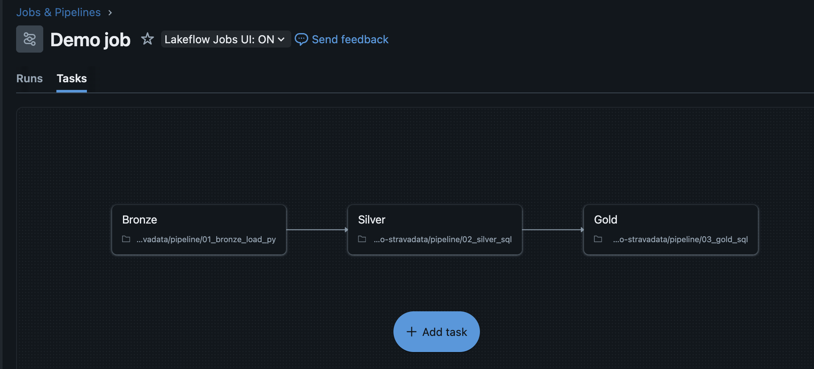
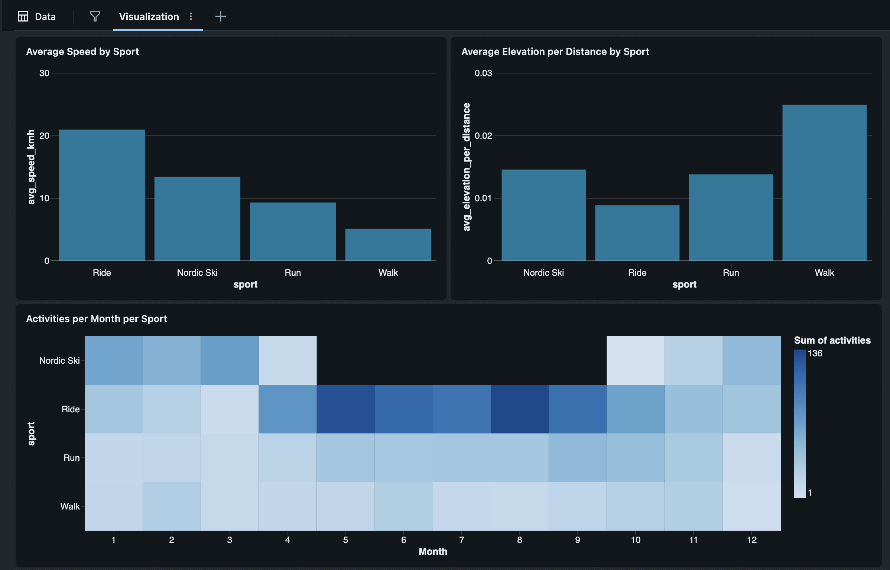

# databricks-demo-stravadata

Databricks demo pipeline project with my [Strava](https://www.strava.com/dashboard) activity data. 

This pipeline filters the activities only to those Walk, Run, Ride, and Nordic Ski activities that have certain columns available (not NULL). The total number of these activities is around 1700 as of Oct 2025. *NOTE:* This is an imperative pipeline as opposed to the newer Lakeflow Declarative Pipeline. It can be run by creating a job like in the above image, in the Databricks UI.

## Content

- `setup` contains code for creating the catalog, schemas, and a landing volume
- `pipeline` contains the actual pipeline code, using the Medallion architechture
- `exploration.ipynb` is a notebook for studying the data in different phases of the pipeline
- `dashboard.lvdash.json` is a dashboard that can be viewed in the Databricks UI. Below is an example of the dashboard that I made with the Databricks editor.

## Data flow

1. Raw `activities.csv` file is dropped into the landing volume. This I have obtained by exporting my data from Strava. 
2. Bronze transformations handle csv reading, and sanitizing the column names of the activities.
3. Silver transformations select certain columns, creates new columns, handles de-duplication and drops rows with NULL values.
4. Gold transformations produce data summaries that reveal insights.

## Data insights

The summaries can answer questions like

- What is my average speed for each sport type?
- Which sport is my most common activity type in February?
- Which sport has the most uphills?

## Improvement ideas

- The Lakeflow Declarative Pipeline framework could be used
- The manual data ingestion could be replaced by integration with the Strava API, so that the data is autoloaded, possibly incrementally.
- Weather data of Finland could be downloaded from the internet and `LEFT JOIN`ed with the activities data based on date
- An ML layer could be added. An example ML task could be to try and predict the sport type based on predictor variables like average speed, duration, date, elevation gain, and average temperature.
